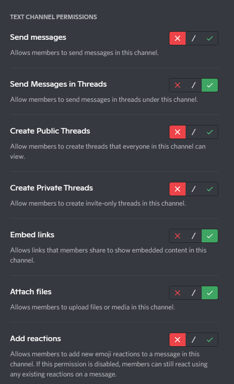
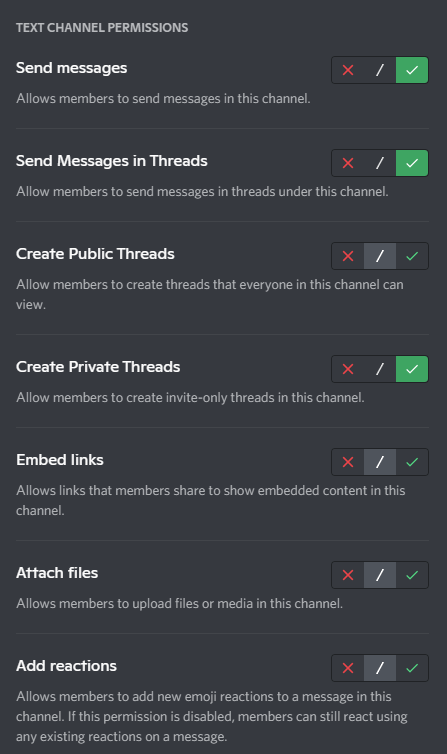

# ModMailBot

> A bot to allow easy, private, in-server communication between members and moderators.

Allows server members to click a button and automatically generate a private thread with server staff members.

## Requirements

- Node v16.6.1
- Discord.js v13.1.0
- Discord server boost level 2 (7 boosts) to unlock private threads

## Setup
`AUTH_TOKEN` environment variable should be set to your Discord bot token. Your chosend staff/moderator role name should be set in `STAFF_ROLE_NAME`

## How to use
To generate the button message, run the command `/generate` inside the channel you want your message to appear. 

Any time the "Contact Staff" button is clicked the bot will then generate a private thread inside this channel and invite the user.

After the user sends their first message inside the private thread the bot will ping your chosen staff role, alerting them to a new mod-mail message, and inviting them to the thread.

## Permission setup

### `@everyone` channel permissions:

### Bot channel permissions:
